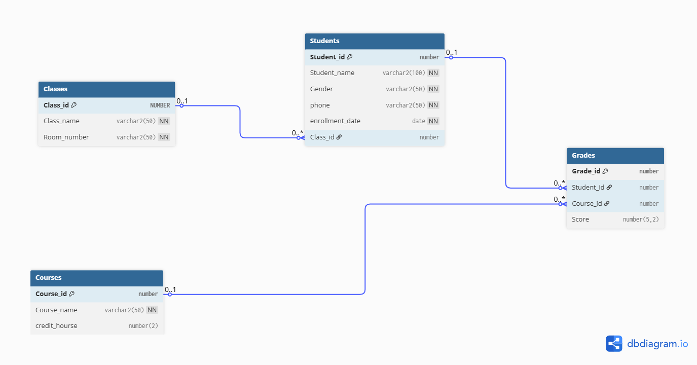

# 🏫 School Management System (Oracle DB & Power BI)

An end-to-end Enterprise Data Analytics project featuring a relational database schema designed in Oracle SQL and an interactive executive management dashboard developed in Power BI Desktop.

---

## 📌 Project Architecture & Data Model (ERD)

The system is built on a structured relational schema consisting of `Classes`, `Students`, `Courses`, and `Grades` tables linked via Primary and Foreign Keys.

### Key Database Entities & Relationships:
- **Classes ➔ Students**: One-to-Many (`1:N`)
- **Students ➔ Grades**: One-to-Many (`1:N`)
- **Courses ➔ Grades**: One-to-Many (`1:N`)

---

## 📊 Interactive Dashboard (Power BI)

The dashboard provides key performance indicators (KPIs) and operational insights for school administrators.

### Features & Insights:
- **Total Students KPI Card**: Dynamic count tracking total enrollment (41 Students).
- **Students per Class**: Clustered Column Chart visualizing distribution across forms.
- **Gender Distribution**: Interactive Pie Chart representing demographic breakdown.
- **Detailed Student Roster**: Data table showcasing student records.

---

## 🛠️ Tech Stack & Tools

- **Database**: Oracle Database (PL/SQL / Oracle SQL Developer)
- **Data Modeling**: DBdiagram.io / Data Modeler
- **Visualization**: Power BI Desktop
- **Repository Structure**:
  - `oracle_script.sql` - Full DDL & DML script (Table structures & Data insertion)
  - `School_Management_Dashboard.pbix` - Power BI Desktop source file
  - `dashboard_preview.png` - Visual preview of the dashboard
  - `erd_diagram.png` - ERD Relationship Diagram

---

## 🚀 How to Run & Replicate

1. **Database Setup**:
   - Run `oracle_script.sql` in Oracle SQL Developer to create tables (`Classes`, `Students`, `Courses`, `Grades`) and insert sample data.
2. **Power BI Connection**:
   - Open `School_Management_Dashboard.pbix` in Power BI Desktop.
   - Update the Oracle Database connection string (`localhost:1521/XE`) to match your local Oracle instance.
